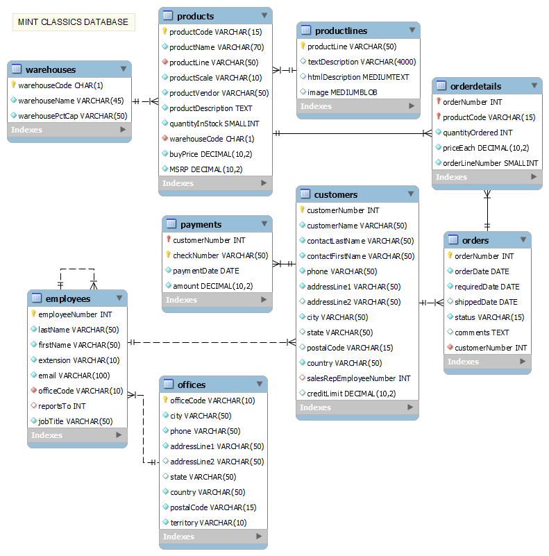

Mint Classics Company SQL Analysis
=============================================
2023-10-03

**Project Scenario**
Mint Classics Company, a retailer of classic model cars and other vehicles, is looking at closing one of their storage facilities. They are looking for suggestions and recommendations for reorganizing or reducing inventory, while still maintaining timely service to their customers.

**Tools Used**
MySQL Workbench, MySQL

**Data Understanding**
This project used data imported from a relational database and has the ER diagram shown below.

